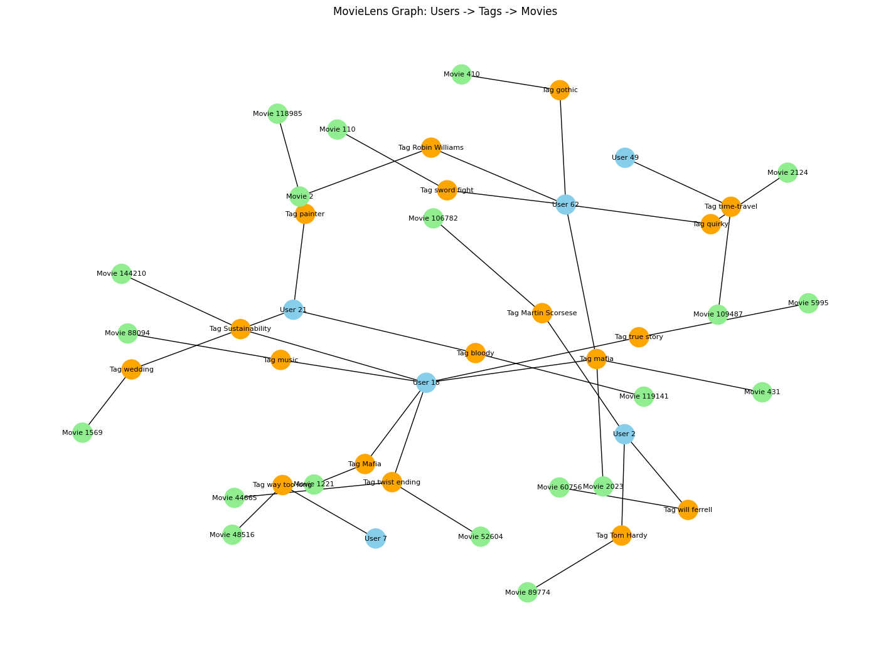
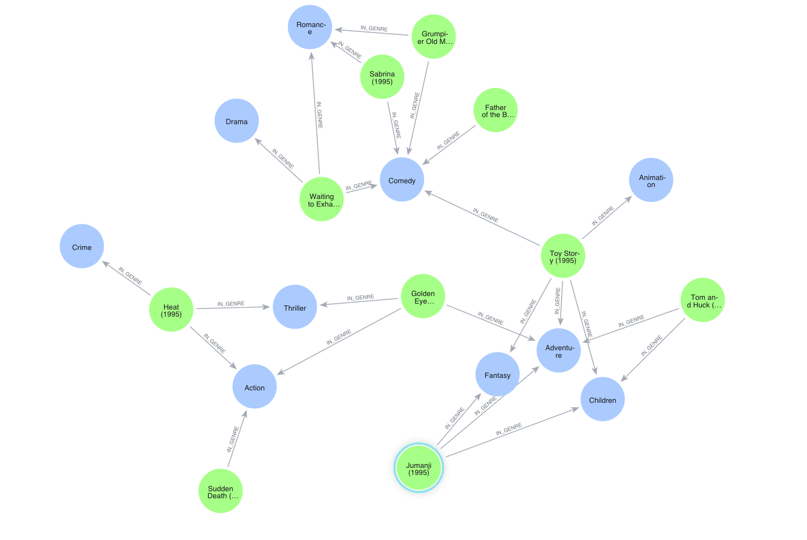
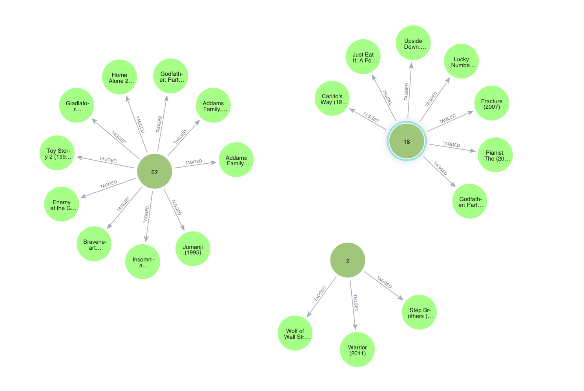
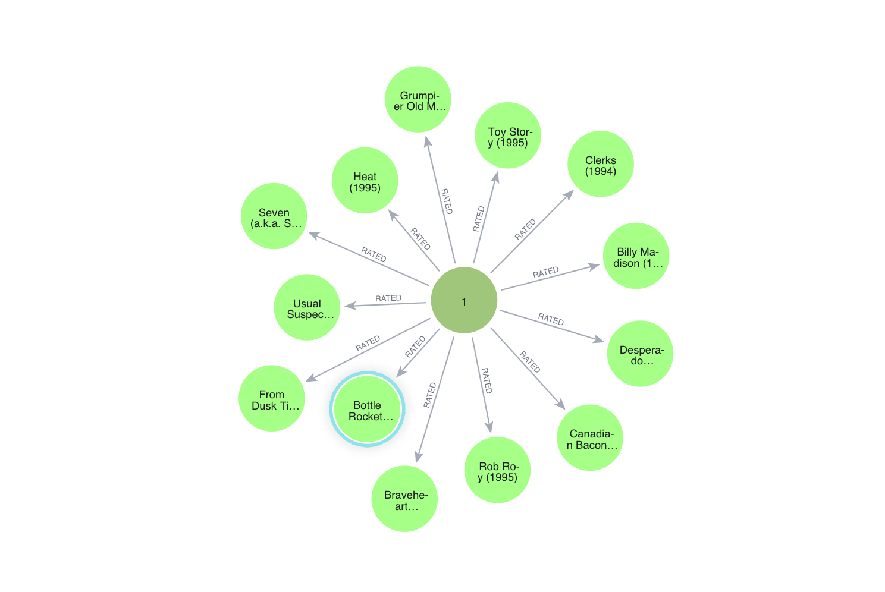

# 📽️ Neo4j Graph Project

## Overview

This project demonstrates how to build a **graph database** and perform **Cypher queries** using **Neo4j** with the [MovieLens dataset](https://grouplens.org/datasets/movielens/).  

The database models:

- **Movies** (`Movie` nodes)  
- **Users** (`User` nodes)  
- **Genres** (`Genre` nodes)  
- **Tags** (`Tag` nodes or properties)  
- **Ratings** (`RATED` relationships)  

It also includes examples of **Cypher queries**, **data import**, and **Python-based visualization** using **NetworkX**.

---
## 🖼️ Visualization Screenshots
**Relation: User-[Tag]->Movie**

**Relation: Movie->Genre**

**Relation: User-[Tagged]->Movie**

**Relation: User-[Rated]->Movie**


---

## Dataset

The following CSV files are used:

| File         | Description |
|-------------|-------------|
| `movies.csv` | Movie metadata (movieId, title, genres) |
| `ratings.csv` | User ratings (userId, movieId, rating, timestamp) |
| `links.csv`  | Id for Imdb and Tmbd page (movieId, imdbId, tmdbId)\
| `tags.csv`   | User tags (userId, movieId, tag, timestamp) |

---

## Setup

### 1. Install Neo4j Desktop or Server

- Download Neo4j: [https://neo4j.com/download/](https://neo4j.com/download/)  
- Create a database (e.g., `movies`)  

### 2. Install Python Dependencies

```bash
pip install notebook neo4j networkx matplotlib
```

### 3. Move the csv files to Import

- Move all the csv files to Import folder. (Neo4j Desktop>Open>Instance Folder>import)
- Then Run the notebook as usual
